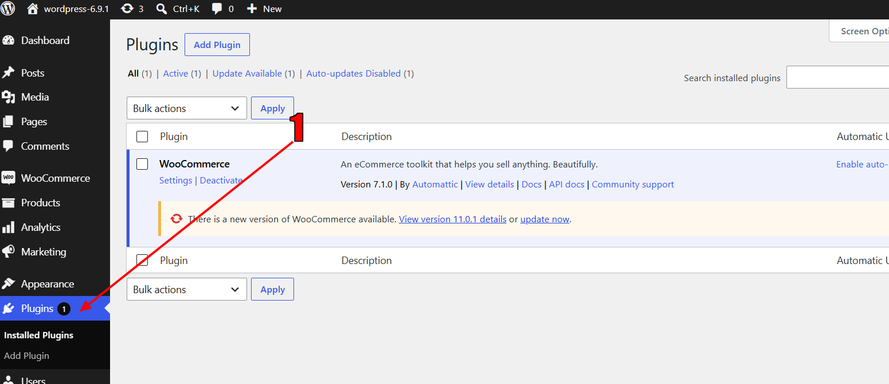
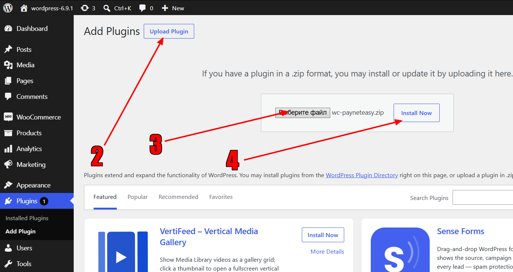
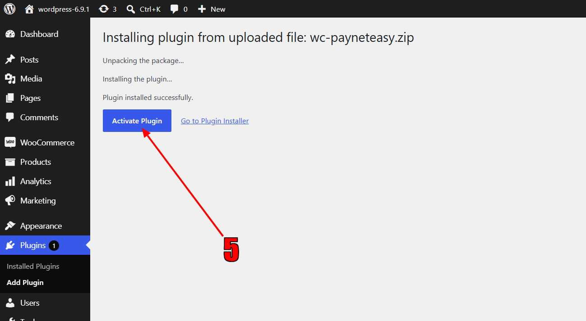
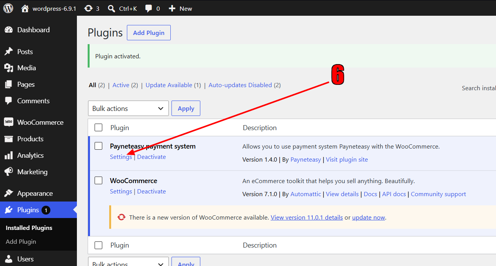
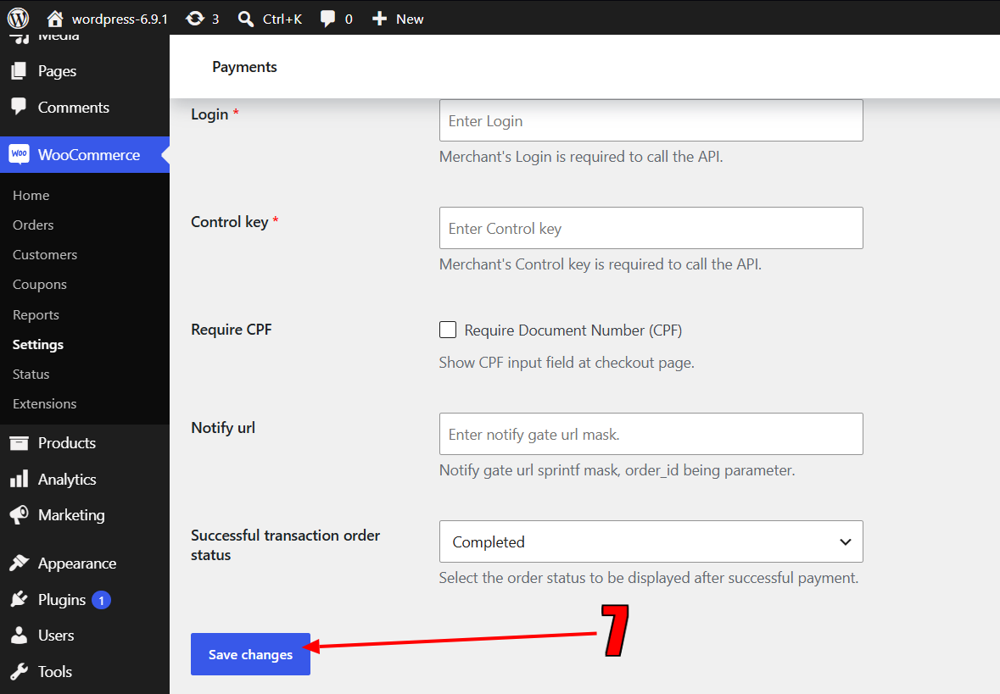

# Plugin for WordPress with WooCommerce

tested on WordPress 7.0, 6.9.1, 6.8.3, 6.6.  
with WooCommerce 9.5.1, 9.3.4, 8.7.0, 7.1.2.

# Installation and configuration

1. In admin section "Plugins" click "Add Plugin" 
2. On next page click "Upload plugin"
3. Then "Select file" <a href="https://github.com/payneteasy/php-plugin-woocommerce/releases/download/v1.4.2/wc-payneteasy.zip">wc-payneteasy.zip</a>
4. And "Install now" 
5. On next page click "Activate plugin" 
6. After installation completed, on plugins page, click "Settings" 
7. And then after filling necessary parameters, click "Save" 
8. Installation and configuration completed.
